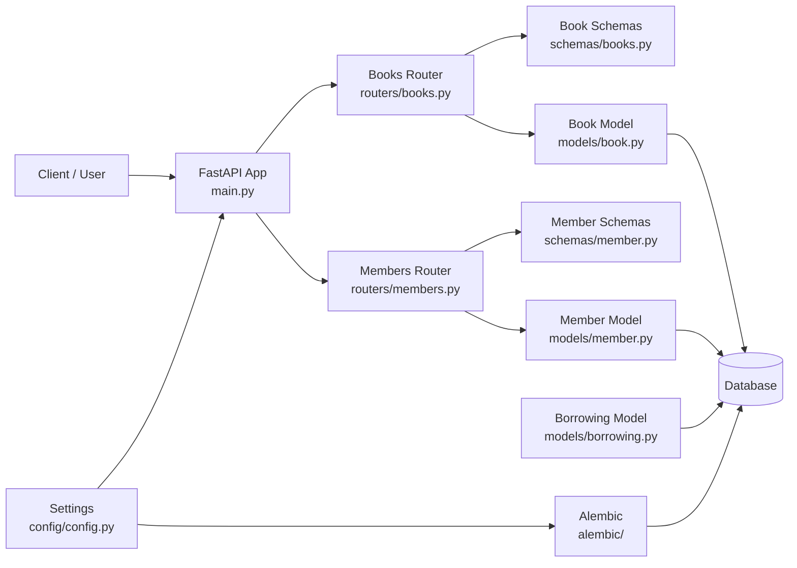
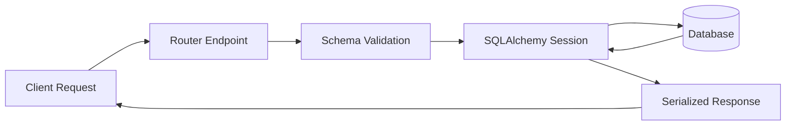
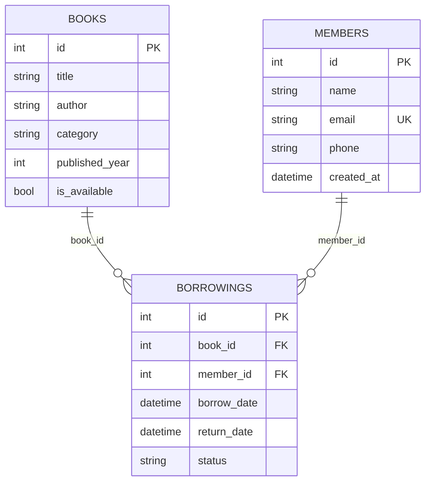

# 📚 Book Library with FastAPI

<div align="center">

A RESTful library management API built with **FastAPI**, **SQLAlchemy**, and **Alembic**.

It provides CRUD operations for books and members, plus a relational database schema for borrowing records.


</div>

---

## 📖 Overview

This project is a backend API for managing a simple book library system. It is intended for learners, portfolio projects, and teams that need a clean FastAPI + SQLAlchemy starter with migrations.

At a high level, requests enter FastAPI routers, data is validated with Pydantic schemas, persisted through SQLAlchemy models, and managed through an Alembic migration history.

## ✨ Features

- 📘 Book management (create, read, update, delete)
- 👤 Member management (create, read, update, delete)
- 🗂️ Relational schema for borrowings (book-member links)
- 🔍 API documentation via Swagger UI (`/docs`) and ReDoc (`/redoc`)
- 🧱 Database migrations with Alembic
- 🔌 Configurable database connection using environment variables
- ❤️ Health-style DB connectivity check endpoint (`/db-check`)

## 🏗️ System Architecture



## 🔄 Application Flow



## 🛠️ Tech Stack

| Category | Technologies |
|---|---|
| Backend | FastAPI |
| Language | Python |
| ORM | SQLAlchemy |
| Data Validation | Pydantic |
| Settings Management | pydantic-settings |
| Database Migrations | Alembic |
| Database | Configured via `DATABASE_URL` (SQLAlchemy engine) |

## 📂 Project Structure

```text
book-library-with-fast-api/
├── main.py                  # FastAPI app entrypoint
├── database.py              # Engine, session factory, DB dependency
├── config/
│   └── config.py            # Environment-based settings
├── routers/
│   ├── books.py             # Book API routes
│   └── members.py           # Member API routes
├── schemas/
│   ├── books.py             # Book request/response schemas
│   └── member.py            # Member request/response schemas
├── models/
│   ├── book.py              # Book ORM model
│   ├── member.py            # Member ORM model
│   └── borrowing.py         # Borrowing ORM model
├── alembic/
│   ├── env.py               # Migration environment setup
│   └── versions/            # Migration revisions
├── alembic.ini              # Alembic configuration
└── README.md
```

## 🧩 Main Modules

- **Application entry (`main.py`)**
  - Initializes FastAPI and mounts books/members routers.
  - Exposes base endpoints (`/`, `/db-check`).

- **Routers (`routers/`)**
  - Encapsulate API endpoints per domain (`books`, `members`).
  - Use dependency-injected SQLAlchemy sessions.

- **Schemas (`schemas/`)**
  - Define request payload and response output contracts.
  - Control optional/required API fields.

- **Models (`models/`)**
  - Define persistent entities: `books`, `members`, `borrowings`.
  - Establish FK relationships through `Borrowing`.

- **Database & config (`database.py`, `config/config.py`)**
  - Builds SQLAlchemy engine from `DATABASE_URL`.
  - Provides request-scoped DB sessions.

- **Migrations (`alembic/`)**
  - Tracks schema history for books, members, and borrowings tables.

## 🗄️ Database Design

### Entities

- **books**: catalog records
- **members**: registered library members
- **borrowings**: junction/history records linking books and members



## 🔌 API Documentation

### Core

| Method | Endpoint | Description |
|---|---|---|
| GET | `/` | Basic API welcome response |
| GET | `/db-check` | Verifies DB connection with `SELECT 1` |

### Books

| Method | Endpoint | Description |
|---|---|---|
| GET | `/books/get-books` | Retrieve all books |
| GET | `/books/get-book/{book_id}` | Retrieve one book by ID |
| POST | `/books/create-book` | Create a new book |
| PUT | `/books/update-book/{book_id}` | Update a book |
| DELETE | `/books/delete-book/{book_id}` | Delete a book |

### Members

| Method | Endpoint | Description |
|---|---|---|
| GET | `/members/get-members` | Retrieve all members |
| GET | `/members/get-member/{member_id}` | Retrieve one member by ID |
| POST | `/members/create-member` | Create a new member |
| PUT | `/members/update-member/{member_id}` | Update a member |
| DELETE | `/members/delete-member/{member_id}` | Delete a member |

## 🚀 Getting Started

### Prerequisites

- Python **3.10+**
- pip
- A SQLAlchemy-compatible database URL (set in `.env`)

### Clone the Repository

```bash
git clone <repository-url>
cd book-library-with-fast-api
```

### Installation

Because no lock/dependency file is currently committed, install dependencies manually:

```bash
pip install fastapi "uvicorn[standard]" sqlalchemy alembic pydantic-settings
```

> If your `DATABASE_URL` uses PostgreSQL, install a PostgreSQL driver (for example `psycopg[binary]`).

### Run the Project

```bash
uvicorn main:app --reload
```

Open:

- Swagger UI: `http://127.0.0.1:8000/docs`
- ReDoc: `http://127.0.0.1:8000/redoc`

### Run Migrations

```bash
alembic upgrade head
```

## 🔐 Environment Variables

Create a `.env` file in the project root:

```env
DATABASE_URL=your_database_url
```

Example patterns:

- PostgreSQL/Supabase: `******host:5432/dbname`
- SQLite: `sqlite:///./library.db`

## 📸 Screenshots

The repository currently does not include screenshot assets.

Recommended captures to add later:
- Swagger UI (`/docs`)
- Example book CRUD requests/responses
- Example member CRUD requests/responses

## 🔐 Security

Current security-related behaviors present in code:

- Input validation through Pydantic schemas
- Database credentials externalized via environment variables
- No hardcoded API keys or tokens in source files

> Authentication/authorization is not implemented in the current codebase.

## 🤝 Contributing

1. Fork the repository (or clone if you have access)
2. Create a feature branch:
   ```bash
   git checkout -b feature/your-feature-name
   ```
3. Implement your changes
4. Run local checks and test the API manually
5. Commit:
   ```bash
   git commit -m "feat: describe your change"
   ```
6. Push your branch and open a Pull Request

## 👥 Contributors

- Ahmad Irshaid

## 📄 License

No license file is currently present in this repository.
